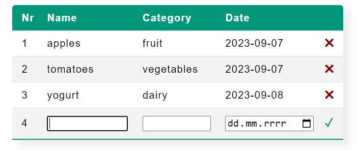

# Food Manager
App created in the process of learning JavaScript. It allows you to manage your food list. You can add new ingredients with category and date to the list. You can also delete row from the list.

## Table of contents

- [Overview](#overview)
    - [The challenge](#the-challenge)
    - [Screenshot](#screenshot)
    - [Links](#links)
- [My process](#my-process)
    - [Built with](#built-with)
    - [What I learned](#what-i-learned)

## Overview

### The challenge

Users should be able to:

- See table with food list
- Add new ingredient with category and date to the list
- Delete row from the list

### Screenshot

### Links

- Solution URL: [github.com/AleksandraPetryka/Food-Manager](https://github.com/AleksandraPetryka/Food-Manager)
- Live Site URL: [aleksandrapetryka.github.io/Food-Manager/](https://aleksandrapetryka.github.io/Food-Manager/)

## My process

### Built with

- Vanilla JavaScript
- CSS
- Firebase

### What I learned
- Deep understanding of JavaScript.
- How to use Firebase.
